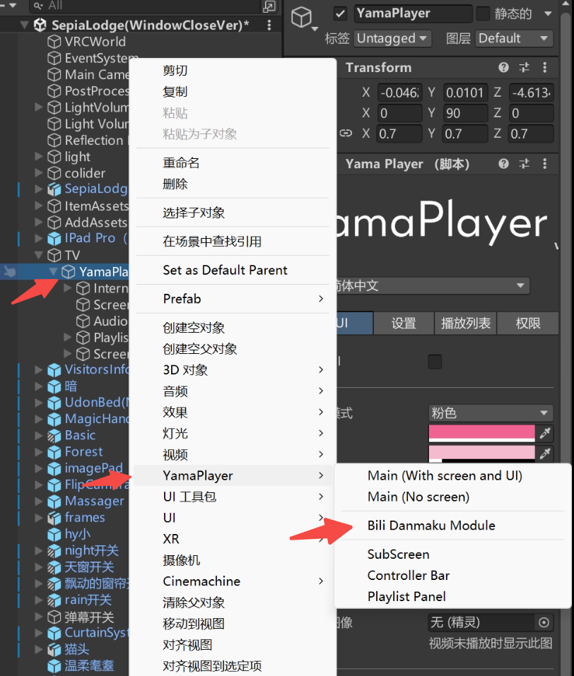
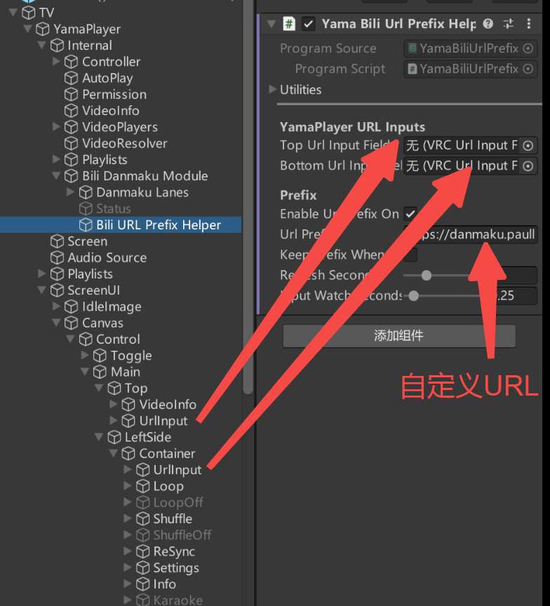
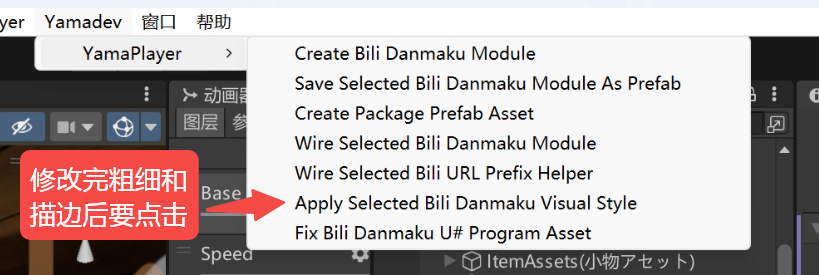

# PaulKoiPlayer

<p align="center">
  
</p>

[简体中文](README.md) | [English](README_EN.md)

[vrc-bilibili-danmaku](https://github.com/sodakitten/PaulKoiPlayer-vrc-bilibili-danmaku) 是 **PaulKoiPlayer** 的 VRChat 哔哩哔哩弹幕组件，为 VRChat 世界视频播放器提供哔哩哔哩弹幕加载、同步与渲染功能。

示例世界：[https://vrchat.com/home/world/wrld_c57b6e50-c63b-42d2-b30d-b76b0562f604](https://vrchat.com/home/world/wrld_c57b6e50-c63b-42d2-b30d-b76b0562f604)

YamaPlayer PC / 桌面端当前正式稳定版为 **1.10**，由已验证的 `beta13.43` 转正并发布到 GitHub。本次 1.10 Release **只包含 YamaPlayer PC / 桌面端适配包**；iwaSync3 和 VizVid 仍保持当前公开版本。Android / Quest 普通大屏或非可拾取播放器继续使用 **1.03**；Android / Quest 可拾取平板场景请使用独立的 `YamaBiliDanmakuTabletV3` 平板包，该包不包含在 1.10 Release 中。

> 本项目不是 VRChat、哔哩哔哩或 YamaPlayer 的官方组件。

## 使用前需要安装

如果你是用 VCC 创建的 VRChat World 项目，项目里通常已经包含 VRChat Worlds SDK 和 UdonSharp。除此之外，需要安装你实际使用的播放器：

- [YamaPlayer](https://github.com/koorimizuw/YamaPlayer)：使用 `YamaBiliDanmakuV3` 或 `YamaBiliDanmakuTabletV3` 时需要。
- iwaSync3：使用 `IwaBiliDanmakuV3` 时需要。
- VizVid：使用 `VizVidBiliDanmakuV3` 时需要。
- TextMeshPro：Unity 项目中需要已导入 TMP Essentials。
- Docker：只在你要自行部署 `server/` 后端时需要；只使用公开解析服务时不需要。

如果不想自行部署后端，可以直接使用已经部署好的公共服务。在 `Bili URL Prefix Helper` 的 `Url Prefix` 中填写：

```text
https://danmaku.paulkoishi.com/player/?url=
```

公共服务状态页：[https://danmaku.paulkoishi.com/](https://danmaku.paulkoishi.com/)。如果该页面无法访问，说明当前公共服务不可用。

这个公共入口目前支持：

- B 站视频解析，并可为本组件返回对应 B 站弹幕。
- B 站直播解析，但直播暂不返回弹幕。
- 网易云音乐单曲解析。
- 网易云音乐歌单解析。YamaPlayer 1.10 可在世界内显示歌单并通过后端 `vcrid` 播放对应曲目。
- B 站多 P、合集与列表解析。YamaPlayer 1.10 可显示条目标题、切换条目并连续播放。

如果你自行部署了本项目的 `server/` 后端，把上面的域名替换成自己的域名，也可以获得同样的解析能力。

## 项目结构

- `Runtime/`、`Editor/`：YamaPlayer PC / 桌面端 Unity / UdonSharp 弹幕组件。
- `IwaBiliDanmakuV3/`：iwaSync3 专用适配线。
- `VizVidBiliDanmakuV3/`：VizVid 专用适配线。
- `YamaBiliDanmakuTabletV3/`：YamaPlayer Android / Quest 可拾取平板专用适配线。
- [`server/`](server/README.md)：视频解析与弹幕代理服务，提供 Docker 部署。
- [`docs/DEVELOPMENT_NOTES.md`](docs/DEVELOPMENT_NOTES.md)：组件试错、错误修复与演进记录。

## 下载

当前本地包与公开包状态：

- `PaulKoiPlayer-YamaBiliDanmakuV3-1.10.zip`：YamaPlayer PC / 桌面端正式源码包，也是 1.10 Release 唯一的 Unity 适配包。
- `PaulKoiPlayer-IwaBiliDanmakuV3-1.04beta.zip`：iwaSync3 PC / 桌面端源码包。
- `PaulKoiPlayer-VizVidBiliDanmakuV3-1.04beta.zip`：VizVid PC / 桌面端源码包。
- `PaulKoiPlayer-YamaBiliDanmakuTabletV3-android-beta1.5.zip`：YamaPlayer Android / Quest 可拾取平板专用包。

服务端继续使用 v1.0.3 对应的 `server/`。

### Android / Quest 使用说明

YamaPlayer 1.10 沿用已验证的 PC / 桌面端外部显示面挂载规则：如果你选中的是播放器自己的对象，就按播放器根节点生成；如果你选中的是外部平板或显示面，就挂到当前选中的显示面 Transform。

Android / Quest 普通大屏、固定屏幕或非可拾取播放器继续使用 1.03。只有 Android / Quest 可拾取平板需要导入独立的 `YamaBiliDanmakuTabletV3` 包。该包使用独立 namespace、类名、shader 和菜单，生成后需要在 Inspector 中手动拖入播放用的 YamaPlayer `Controller` 作为数据源。

这套 PC 逻辑在 Android / Quest 可拾取平板上曾出现弹幕明显发灰、变淡的问题。因此安卓端的选择应简单分开：普通安卓播放器用 1.03，可拾取平板用 Tablet 包。

## 功能

- 根据播放器当前 URL 自动请求对应弹幕
- 支持滚动、顶部和底部弹幕
- 跟随视频播放进度同步，正确处理暂停和继续播放
- 使用 `RectMask2D` 在播放器画面边缘裁切弹幕
- 支持彩色弹幕、黑色描边和轻微加粗
- 可调整字体缩放、透明度、轨道数、速度和时间偏移
- 仅更新正在显示的弹幕，降低每帧遍历开销
- URL 输入框可预填自定义解析服务前缀
- 提供弹幕开启、关闭和切换事件，方便连接世界内自定义 UI
- YamaPlayer 1.10 支持 B 站多 P/合集/list 与网易云音乐歌单，列表每页最多显示 6 项
- 支持顺序播放（列表循环）与单项循环，并提供首页、上一页和下一页操作
- Pages 状态使用轻量 Udon 手动同步，支持多人当前项目提示和后来加入玩家恢复列表

## 环境要求

- Unity 与当前 VRChat Worlds SDK 兼容的版本
- VRChat Worlds SDK（VCC World 项目通常已经包含）
- UdonSharp（当前 VRChat Worlds SDK 集成版本即可）
- TextMeshPro Essentials
- 你使用的目标播放器：YamaPlayer、iwaSync3 或 VizVid
- 一个能够返回 `#YBDM/1` 文本弹幕的解析服务

默认解析服务前缀：

```text
https://danmaku.paulkoishi.com/player/?url=
```

## 安装

1. YamaPlayer PC / 桌面端使用本地 `1.10.zip`；iwaSync3 和 VizVid 继续使用各自当前版本。
2. 删除旧版目录：
   - `Assets/YamaBiliDanmaku`
   - `Assets/YamaBiliDanmakuV2`
   - `Packages/yama-bili-danmaku*`
3. 将 `YamaBiliDanmakuV3` 文件夹放入 Unity 项目的 `Assets/`。
4. 执行 `Assets > Reimport All`。
5. 执行 `Yamadev > YamaPlayer > Fix Bili Danmaku U# Program Asset`。
6. 执行 `UdonSharp > Compile All UdonSharp Programs`。
7. 选中目标 YamaPlayer，执行 `Yamadev > YamaPlayer > Create Bili Danmaku Module`。



## 手动绑定 URL 输入框

预输入前缀组件的两个 URL 输入框必须在 Inspector 中**手动拖入**。不要依赖自动查找或组件顺序猜测，不同 YamaPlayer 版本或自定义预制体的层级可能不同。

| Inspector 字段 | YamaPlayer 默认对象路径 |
| --- | --- |
| `Top Url Input Field` | `ScreenUI/Canvas/Control/Main/Top/UrlInput` |
| `Bottom Url Input Field` | `ScreenUI/Canvas/Control/Main/LeftSide/Container/UrlInput` |

两个对象都应拖入其自身的 `VRC URL Input Field` 组件。



前缀设置：

- `Enable Url Prefix On Input`：控制预输入功能，默认开启。
- `Url Prefix`：自定义解析服务地址；不自托管时可填写 `https://danmaku.paulkoishi.com/player/?url=`。
- `Keep Prefix When Empty`：持续补回空输入框；若希望玩家可以手动删除前缀，请保持关闭。

## 播放视频

玩家在 YamaPlayer 输入框中填写：

```text
https://danmaku.paulkoishi.com/player/?url=<哔哩哔哩视频链接>
```

也可以填写 B 站直播链接、网易云单曲链接，或网易云歌单链接。网易云歌单需要额外加 `&p=数字` 选择第几首：

```text
https://danmaku.paulkoishi.com/player/?url=<网易云歌单链接>&p=1
```

同一 URL 由视频播放器请求时返回视频解析结果，由 `VRCStringDownloader` 请求时返回弹幕文本，因此不需要 `room` 或世界实例标识。

## 常用设置

> **这些设置只能在 Unity 编辑器中调整。** YamaPlayer 1.10 生成轻量的玩家控制与播放列表界面。字体大小、透明度、粗细、描边、轨道数、滚动速度和时间偏移仍需要由世界作者在 Unity Inspector 中配置，并在上传世界前保存。

| 设置 | 默认值 | 说明 |
| --- | ---: | --- |
| `Lane Count` | 12 | 弹幕轨道数量 |
| `Scroll Duration` | 8 | 滚动弹幕通过画面的秒数 |
| `Static Duration` | 4 | 顶部/底部弹幕停留秒数 |
| `Time Offset Ms` | 0 | 弹幕时间校正 |
| `Max Danmaku Lines` | 4096 | 单次加载的最大弹幕条数 |
| `Font Scale` | 1.1 | 字体显示缩放 |
| `Text Alpha` | 0.72 | 字体透明度 |
| `Outline Width` | 0.11 | TMP 黑色描边宽度 |
| `Outline Alpha` | 0.7 | 描边透明度 |

### 让描边和粗体修改真正生效

`Editor Visual Style` 下的粗体、描边宽度和描边透明度不是运行时实时修改项。调整现有模块后，必须重新把设置应用到 TextMeshPro 材质：

1. 在 Hierarchy 中选中已经生成的 `Bili Danmaku Module` 对象。
2. 在 `Yama Bili Danmaku Module 3` 组件的 `Editor Visual Style` 中修改：
   - `Editor Bold Text`
   - `Editor Heavy Outline Enabled`
   - `Editor Outline Width`
   - `Editor Outline Alpha`
3. 保持该对象处于选中状态，执行：

```text
Yamadev > YamaPlayer > Apply Selected Bili Danmaku Visual Style
```



4. 检查 Console 出现应用成功提示，再进入 Play Mode 或重新上传世界。

只修改 Inspector 数值但不执行上述 Apply 菜单，已有弹幕文字的材质不会更新，看起来就会像描边或粗细没有变化。新生成的模块会在创建时自动应用当前默认样式。

## 世界内弹幕控制

YamaPlayer 1.10 会在 `Bili Danmaku Module` 下生成中文的轻量控制界面：

- `弹幕范围：全屏 / 半屏 / 1/4屏`：循环切换显示区域。
- `弹幕：开启 / 关闭`：切换弹幕显示与隐藏。
- `URL 回填：开启 / 关闭`：控制输入框前缀回填。
- `播放列表`：显示 B 站分 P/合集/list 或网易云音乐歌单；可切换顺序播放和单项循环。

切换显示区域时，已经发射出来的弹幕不会被清空；后续新弹幕会按新的区域输出。

这些 Udon 公开事件仍可供世界作者自定义 UI 或脚本调用：

```text
ToggleDanmaku
EnableDanmaku
DisableDanmaku
SetFullScreenDanmaku
SetHalfScreenDanmaku
SetQuarterScreenDanmaku
CycleDisplayAreaMode
```

## 常见问题

### 找不到有效的 U# Program Asset

依次执行：

```text
Yamadev > YamaPlayer > Fix Bili Danmaku U# Program Asset
UdonSharp > Compile All UdonSharp Programs
```

如果仍然失败，在 `Assets/YamaBiliDanmakuV3/Runtime` 中手动创建 U# Script，保留生成的 `.asset`，并将其 Source C# Script 指向 `YamaBiliDanmakuModule3.cs`。

### 显示 Loaded 但没有弹幕

- 确认播放器当前 URL 使用支持弹幕响应的解析服务。
- 确认 `Controller`、`Lane Root` 和 `Text Pool` 已正确绑定。
- 确认 `Danmaku Enabled` 已开启。
- 不要混用旧版组件和旧版 U# Program Asset。

## 当前版本说明

YamaPlayer 1.10 相比 1.04beta 主要增加：

- 新增通用 `播放列表` 面板，不再只叫 `Bili Pages`；支持 B 站多 P、合集/list 和网易云音乐歌单。
- 每页最多显示 6 项，提供首页、上一页、下一页、顺序播放和单项循环按钮。
- 通过后端预生成的 `vcrid` 播放条目，避免在 Udon 运行时动态构造 `VRCUrl`。
- 默认顺序播放并在列表末尾回到第一项；单项循环复用 YamaPlayer 自身循环状态。
- 修复首次解析、切歌和停止事件可能把完整歌单误缩成单项的问题。
- 新增轻量多人同步：同步清单来源、当前项目、循环模式和修订号；后来加入的玩家可重新下载完整列表。
- 非所有者的停止事件不会清空公共列表，列表中当前项目以播放器实际播放的 `vcrid` 为准。
- 修复多位 `vcrid` 被截断的问题，P52、P150 等较大分 P 编号能够正确匹配播放项目。
- 用户主动翻页后，首次列表加载完成或队列标题回填不会再把面板强制跳回首页。
- 世界内控制文字改为中文；保留原有弹幕下载、解析、时间同步、描边、镜子可读和显示区域行为。

1.10 只发布 YamaPlayer PC / 桌面端适配线。iwaSync3、VizVid 与 Android / Quest 平板专用线没有同步这批播放列表功能，也不包含在本次 Release 中。

1.04beta 相比 1.03 主要更新 Unity 组件端：

- PC / 桌面端重新采用已验证的外部显示面挂载逻辑：选中播放器内部对象时仍挂播放器根节点；选中外部平板或显示面时挂到当前选中的显示面 Transform。
- YamaPlayer、iwaSync3、VizVid 三条 PC 适配线保持同一挂载规则。
- Android / Quest 可拾取平板不再塞进普通 YamaPlayer 包硬修，改为独立 `YamaBiliDanmakuTabletV3` 包。

1.02 相比 1.01 主要更新 Unity 组件端：

- 将 `Max Danmaku Lines` 默认值从 1600 提高到 4096，修复高密度弹幕视频只显示开头一小段的问题。
- 弹幕关闭后不再每帧重复隐藏全部文本。
- `HideAllTexts()` 只处理当前 active 弹幕，不再遍历完整对象池。
- 新弹幕发射前只在对象仍 active 时才重置 active 状态，减少无意义 UI 状态变化。
- 新建模块不再给主弹幕 Canvas 添加多余的 `GraphicRaycaster`；重新执行 `Wire Selected Bili Danmaku Module` 会移除旧模块上的多余主 Canvas raycaster。

1.01 相比 v1.0.0 主要更新 Unity 组件端：

- 增加镜子可读的 TextMeshPro 弹幕 shader，参考 YamaPlayer 的 `_MirrorFlip` + `_VRChatMirrorMode` 镜子反转模式，在 VRChat 镜子渲染时预翻转弹幕文字，并保留现有 TMP 描边、Underlay 与轻微加粗。
- 新增 `Danmaku Controls Canvas`，提供世界内玩家可点击的弹幕开关和全屏/半屏/四分之一屏显示区域切换。
- 显示区域切换只影响后续新弹幕，已经在屏幕上的弹幕不会被清空。
- UI 事件绑定改为 backing `UdonBehaviour.SendCustomEvent`，与 YamaPlayer 的事件绑定方式一致。
- 修正长弹幕刚发射时可能在屏幕边缘闪一下的问题。

1.04beta 没有修改 `server/`，服务端继续使用 v1.0.3 对应版本。

v1.0.0 是首个统一发布版本，同时提供 Unity 组件与对应的 Docker 服务端。组件包含彩色弹幕 TMP 描边、轻微加粗、URL 前缀辅助、活动弹幕索引优化，以及暂停后继续播放时的计时补偿。

## 鸣谢与相关链接

- [danmaku.paulkoishi.com](https://danmaku.paulkoishi.com/)：当前公共解析服务状态页；如果无法访问，说明当前公共服务不可用。
- [koorimizuw/YamaPlayer](https://github.com/koorimizuw/YamaPlayer)：当前 YamaPlayer 1.10 适配并测试的 VRChat 视频播放器。
- [music.znnu.com](https://music.znnu.com/)：服务端网易云音乐解析所使用的第三方服务。
- [yionchi](https://github.com/yionchi)：`music.znnu.com` 相关服务作者。

## 后续计划

后续版本会继续补充弹幕密度/数量控制、更多显示区域选项，以及适合 VRChat 的简洁设置界面。实现时会优先保护当前稳定的加载、同步和渲染路径。
